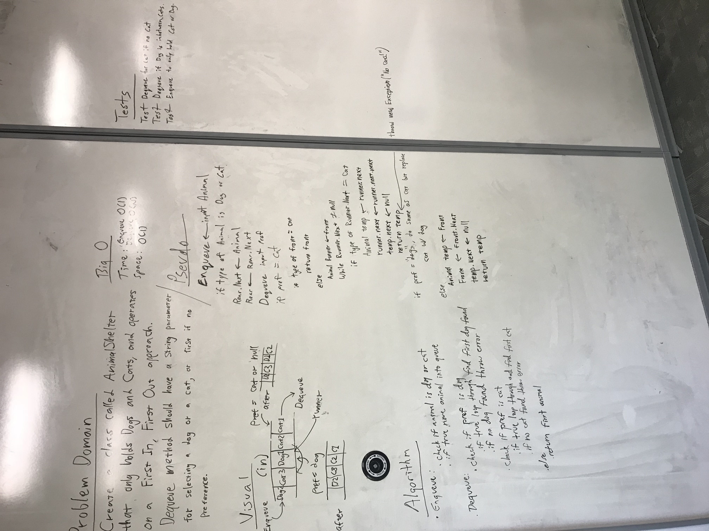

# Animal Shelter

## Challenge
The animal shelter challenge uses a queue to store and find animals. Using first-in, first-out, an animal can be added to the shelter if it is a type cat or dog. When animals are in the shelter, a dequeue preference can be set to cat or dog, and the type of animal closest to the front of the queue will be returned. Otherwise if no preference is set, the first animal in the queue will be retured.

## Example

Base Shelter List

Cat -- Dog -- Dog2 -- null
Enqueue(Cat2)

Cat2 -- Cat -- Dog -- Dog2 -- null

Dequeue(Cat)

Cat2 -- Dog -- Dog2 --  null

## Solution

## How to Use
Navigate the Data_Structures_and_Algorithms folder to the Animal Shelter challenge. This program requires Visual Studio. Once in the .sln assembly file, run the program.cs file to see the results.

## Licensing
This project uses a MIT license.

