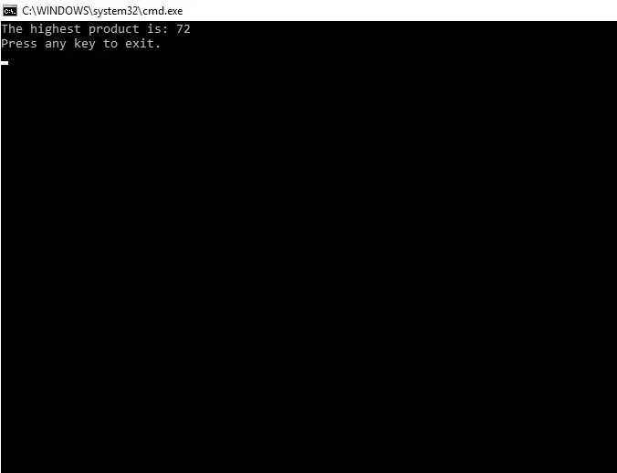
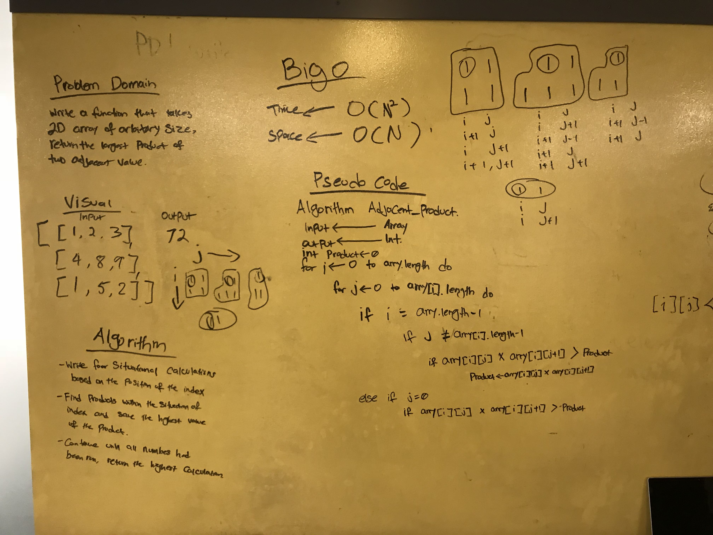

# Array Adjacent Product

## Challenge
AdjacentProduct is a method which takes a 2d array and returns the value of the highest product between 2 adjacent numbers.
ex: [
	[1, 2, 3]
	[4, 5, 6]
	[7, 8, 9]
	]

The highest product returned in the above array would be 72.

## Solution

## Explanation
