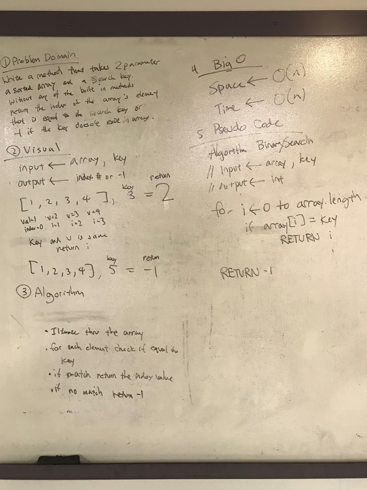

# Binary Search

## Challenge
This search is a method which takes an input array and a key, then returns either the index of the key when found, or -1 if not found.
Example:
InputArray[1, 2, 3, 4, 5], Key = 3 --> 2
InputArray[1, 2, 3, 4, 5], Key = 6 --> -1

## Solution

