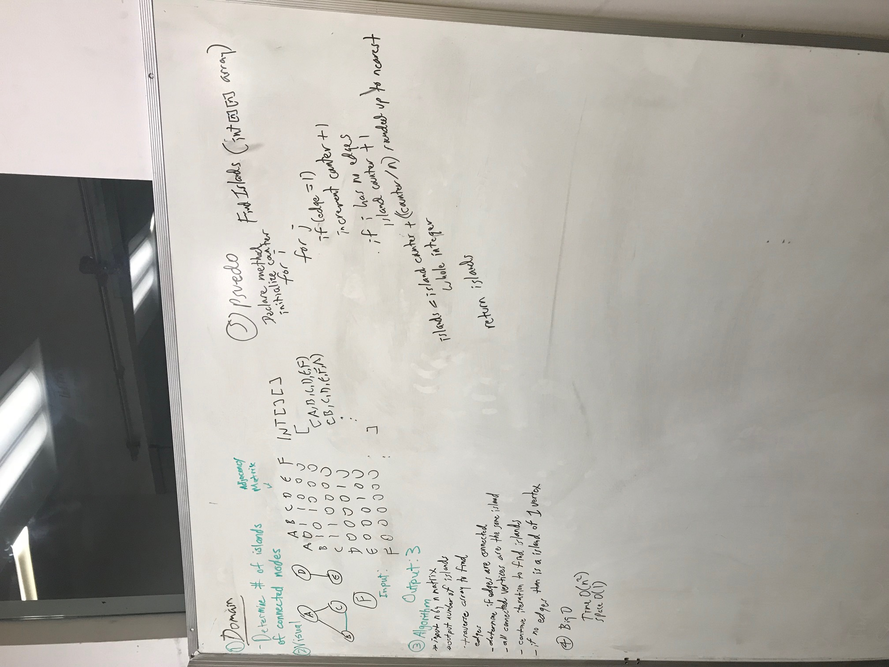

# FindIsland

## Challenge
This challenge was to find islands in a graph. Using a 2D adjaceny matrix representing vertices in a graph, an algorithm had to be designed to return the number of islands. An island in a graph is part of the data structure which is not connected to the rest. A large group of vertices can be an island, as well as two vertices together, or even a single vertex. 

## Visuals

The graph relationship visualized in this program looks like the below image:

##How to Use
This program requires visual studio. Once it is opened, a user just has to navigate to the solution .sln file, then run the program.cs file. 

##Licensing
This project is MIT licensed.

##Acknowledgements
[steph](https://github.com/IndigoShock)