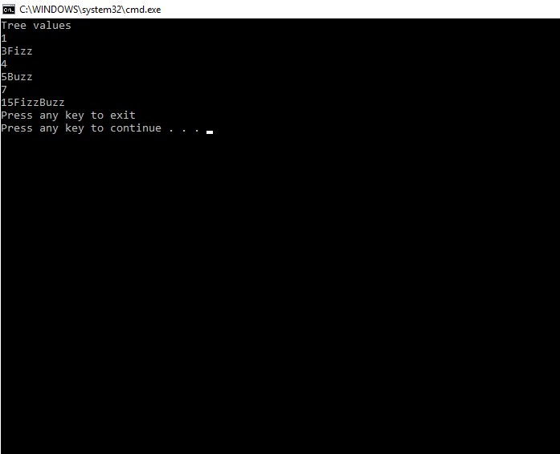

# FizzBuzz Tree

## Challenge

This challenge was to traverse and replace the node values of a binary tree. For node values that were divisble by 3, the value had to be changed to "Fizz". For node values divisible by 5 the value had to be changed to "Buzz". For node values divisble by 3 and 5 the value had to be changed to "FizzBuzz". 

## Examples

##Implementation

The key to this challenge was that since the values had to be changed, the type of value had to be changed. In previous work with nodes, we have used integer values. The choices were to either change the value type for the nodes, or try to convert in the method. We ended up choosing to change the base type for the nodes from an integer to a string, then parse the strings in order to do the math calculations.

##Licensing

This project is MIT licensed.

##Acknowledgements

Steph and Rhiannon