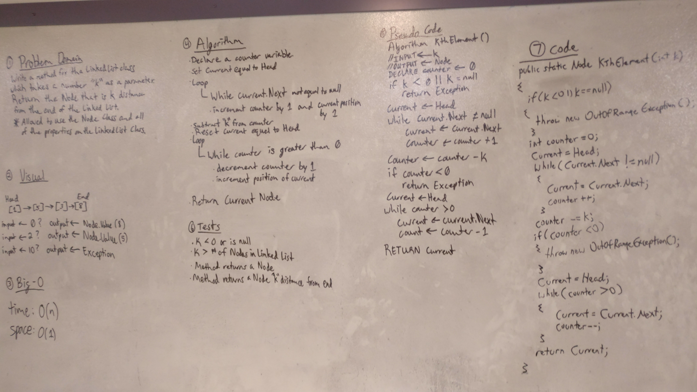

# Kth From End

## Challenge
This challenge was to create a method that could find the Kth element from the end of a linked list. There were two possible solutions. One used a counter variable to get the total amount of nodes in the list, then subtract the value of k from the total and find the node. The other was to use a runner in front of the current value, which resulted in the more efficient solution of only going through the list once, rather than twice. At the end of the algorithm, the value of the found node is returned, or an IndexOutOfRange exception is thrown if the value of k is outside of the list index.
Example:
Create nodes(Values)
	1 2 3 4 5
k = 2 (find second node back from the end of the list)
Linked List
Head5 -->4 --> 3 --> 2 --> 1 --> null
Result = 3

## Solution

