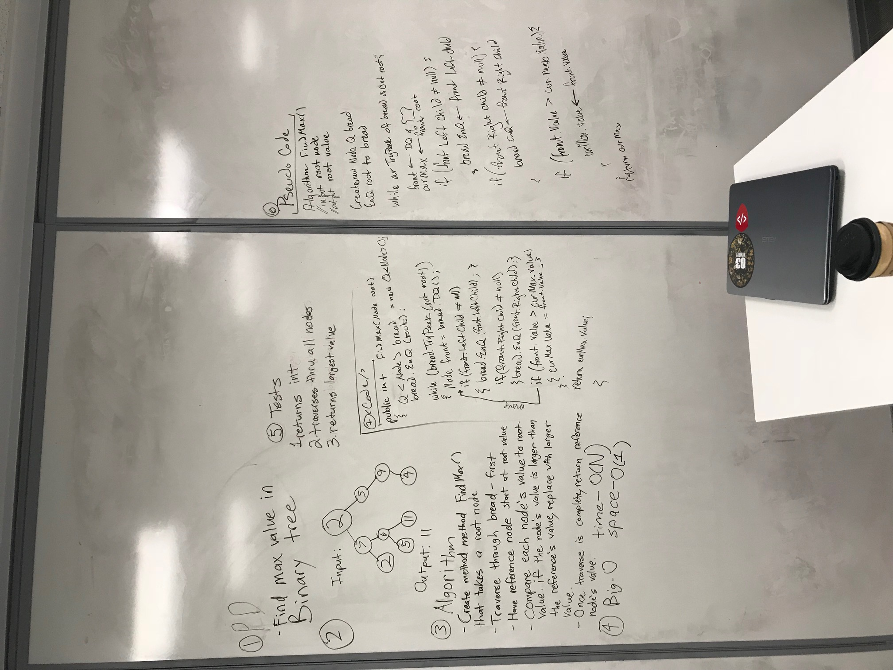
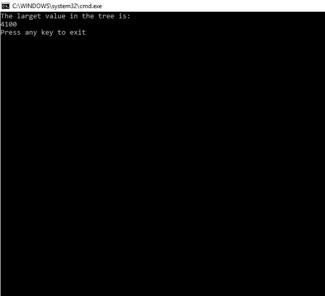

# Find Max Value in a Binary Tree

## Challenge

The challenge was to find the maximum value of a binary tree. Given a tree containing integer values, we needed a method to traverse the tree and return the highest value, which could be present at any node in the tree.

## Examples

##Implementation

To solve the challenge we used the bread-first traversal method. Because the logic for this method requires a queue and dequeue of each node, and a temporary front node, we decided it was the best method. Since each node would be temporarily held, we added a conditional check against a default integer set to 0. Each value was checked, and if the node value was greater than the temp integer, the value was assigned to the temp int. After all the nodes were checked, the temp integer was returned. In this way, no matter where the largest value exists on the tree, by the time the traversal is finished the value will be assigned to the temp integer.

##Licensing

This project is MIT licensed.

##Acknowledgements

Steph and Rhiannon