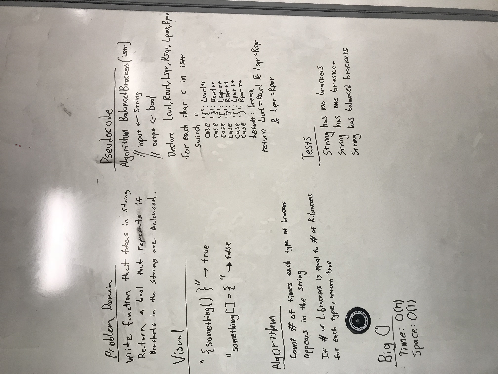

# Multi Bracket Validation

## Challenge
The challenge is to evaluate a string and determine if there are balanced brackets present. This program takes a string as an argument and returns a boolean, set to false if the input string is empty.

## Example
string1 = "{{}}" returns true

string2 = "()]" returns false

string3 = "" returns false

## How to use
This program requires visual studio in order to use the console application. Navigate throught the Data Structures and Alrogithms Repository, then into the MultiBracketValidation folder in challenges. Once the build is complete, run the program.cs file in the assembly to view the results. Different strings can be tested by changing the input strings as an argument to the method.

## Solution

## Licensing
This program uses a MIT license.
