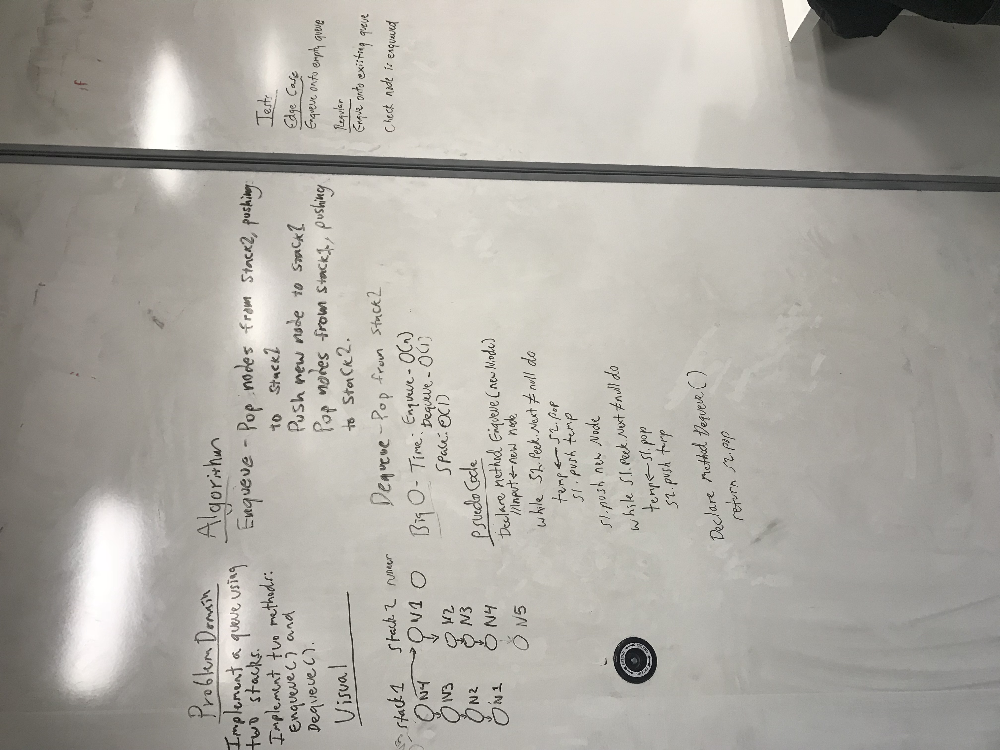

# Stacks with Queues

## Challenge
This challenge was implementing queue behaviors with stacks. For stacks there are methods push, pop, and peek. For queues, there are enqueue and dequeue.

This challenge takes two stacks and replicates queue methods using push and pop. To enqueue, for example, the first stack is popped and pushed to the second stack, and the value of the new node added. The dequeue method pops and pushes the values of stack 2 to stack 1, then removes the last value of stack 2.

Enqueue Example:
stack 1 
1 -- 2 -- 3
stack 2
4 -- 5 -- 6

new node 7

Enqueue output: 7 -- 4 -- 5 -- 6 -- 1 -- 2 -- 3

Dequeue Example
stack 1
1 -- 2 -- 3
stack 2
4 -- 5 -- 6

Dequeue Output: 1 -- 2 -- 3 -- 4 -- 5

## Solution

