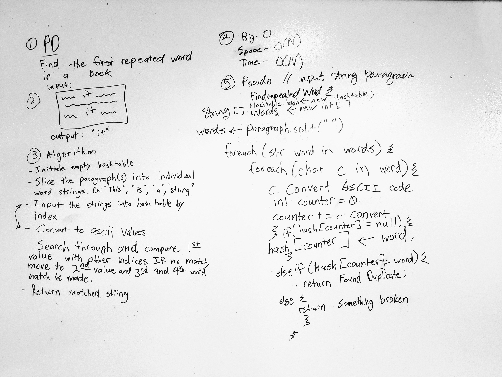

# Find First Repeated Word Challenge

## Challenge
This challenge was to take a input string and return the first repeated matched word. For this challenge the idea was to use a combination of regular expressions and hashtables.

## Visuals

The pseudocode to do this is:

##How to use
There are a couple approaches to this problem set. The implementation here is to use a combination of regular expressions and hash tables. One could also you an array with regular expressions. A hash table makes the most sense, because the word will have to be split into an array, then each word can be evaluated by its Unicode value and assigned to an index. The algorithm would then cycle through the array and return the value of the first index which contains multiple key-value pairs. The value would correspond to the word that matches the conditions. 

##Licensing
This project is MIT licensed.

##Acknowledgements
Life-partner Steph, Jermaine, Collin for the psuedo.