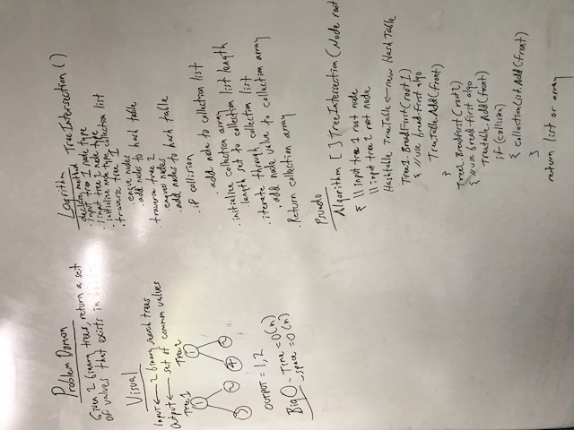

# Tree Intersection Challenge

## Challenge
This challenge was to take a input of two binary trees, and output the matching values in both trees.

## Visuals

The pseudocode to do this is:

##How to use
The primary approach to this problem is using a hash table. With the input of two root node values, the first tree can be added to the hash table. The second tree is then added, but for each collision caused by key values hashing to the same index, the value of that node can be returned.

For example: 
Tree 1: 1, 2, 3 
Tree 2: 1, 2, 4

Tree 1 would be added to the table. Then when tree 2 is added, there would be collisions at the indexes for 1 and 2 so the output would be:

[1, 2]

Additional to this problem is that is has an array return type, so an array would have to be initialized to the length of the hash table, then when a collision gets detected, the node could be added to the array, or just the integer node value.

##Licensing
This project is MIT licensed.