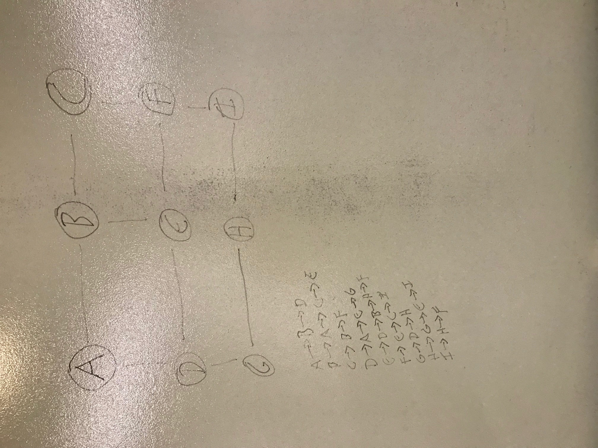

# Graphs

## Challenge
This challenge was implementing a graph. A graph structure is similar to trees, with the exception that there are a possible infinite amount of connecting nodes. Through the progression of implementations we have used Linked Lists, which have one child node, then Trees, which have left and right child nodes. Now graphs are a way of capturing a data structure in a similar manner, with both multiple neighbor nodes in relation to a vertex, and the possibility of islands. An island is a vertex or node that could be alone or connected to other nodes, but is disconnected from other parts of the graph. 

## Visuals

The graph relationship visualized in this program looks like the below image:

##Implementation
In order to implement the graph, a user has to create an instance of a new graph. Once this is done, new nodes can be established and added. To be considered a graph, an additional step has to be taken to add edges or neighbors. An edge is simply a way of describing the line between two nodes, a neighbor node or vertex is considered to be the immediately adjacent nodes to a root node. Unlike a binary tree where the root is established as the base, a graph can set a root anywhere. 

After the graph is created, various methods can be used to get information, such as who the adjacent neighbors are, how many total nodes there are in the graph, and depth or bread-first traversals. In this implementation methods were used to add new nodes, determine neighbors, get total size, and conduct a bread-first traversal. The console output is as below:

##Where Trees are Used
A graph can be used anywhere with needs to link many data points. For example, social network relationships and flight plans are places a graph can be used. In social network relationships, person A has a number of friends, and each of those have a number of friends, and so on. Same with flights, a city might have x amount of flights to a certain place, which has other routes, and eventually leading to the desired destination by traversing the potential flight paths.

##Licensing
This project is MIT licensed.

##Acknowledgements
[jcqnly](https://github.com/jcqnly)
[steph](https://github.com/IndigoShock)