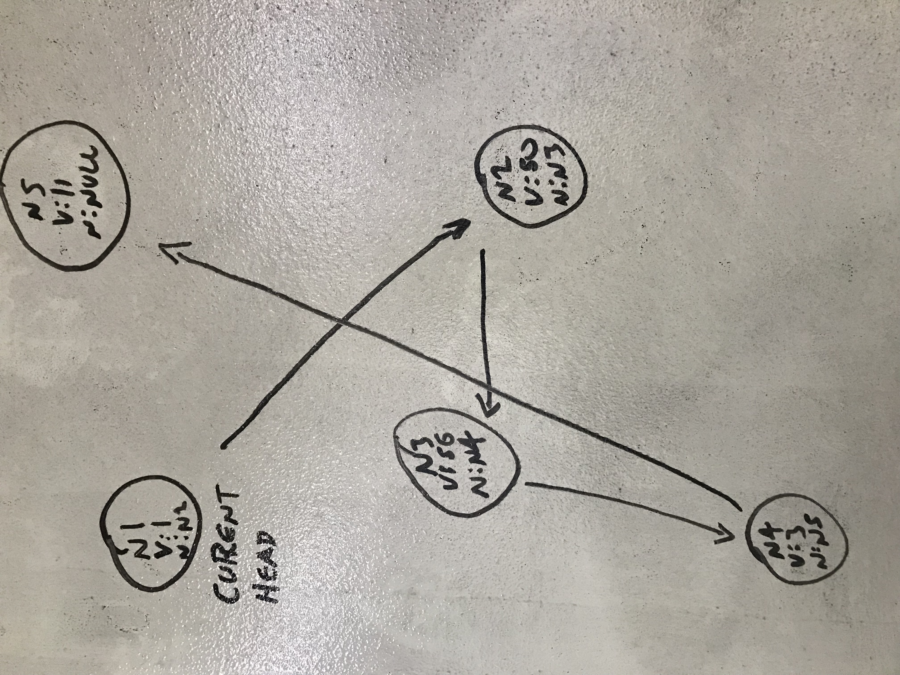

# Linked List

## Challenge
This challenge involved creating and traversing a linked list, creating methods that perform a variety of functions such as finding a node, adding a new node, and adding a new node before and after a currently existing node.
Example:
Create nodes(Values)
	1 2 3 4
Linked List
Head4 --> 3 --> 2 --> 1 --> null

## Solution

