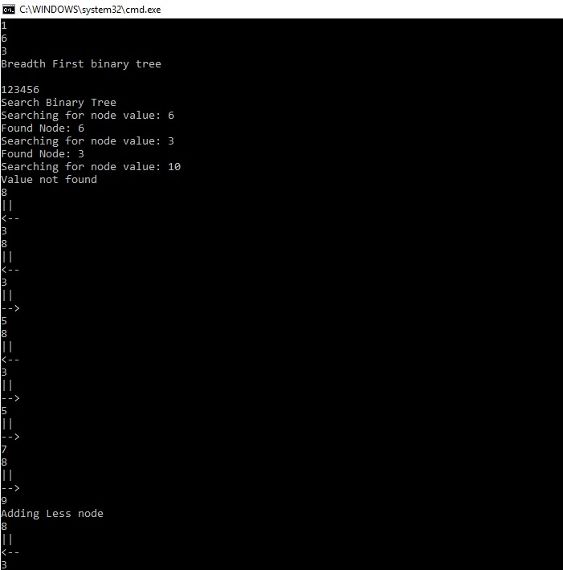
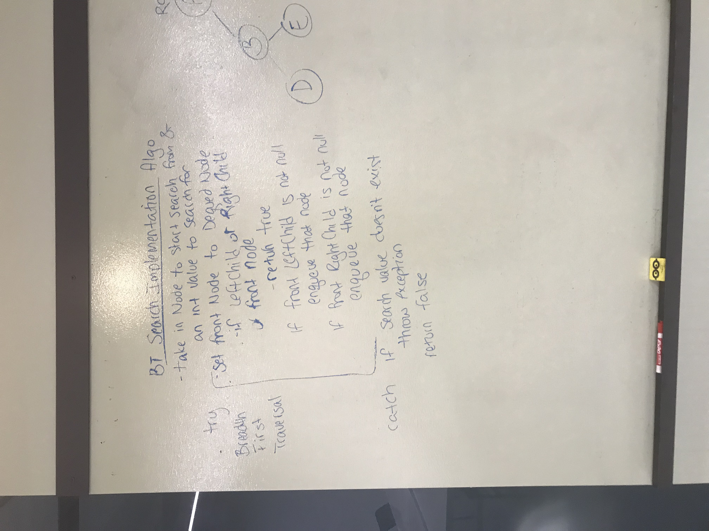
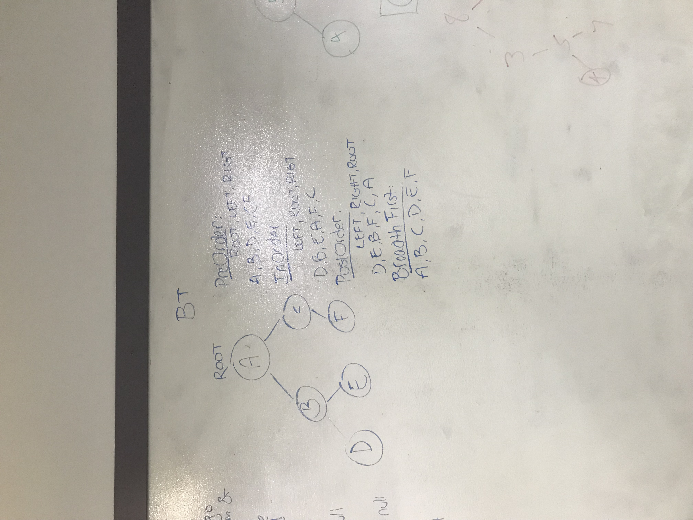
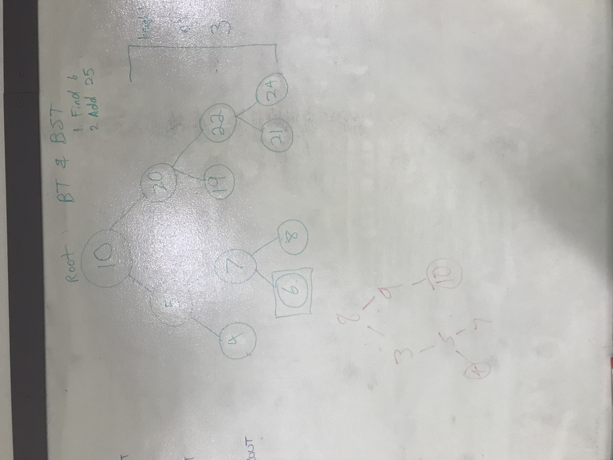

# Binary Tree and Binary Search Tree

## Challenge
This challenge was implementing both a binary tree and a binary search tree.

## Solution

##Licensing
This project is MIT licensed.

##Acknowledgements

