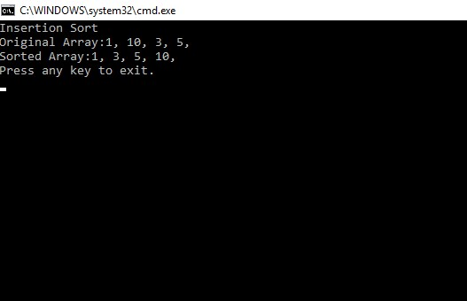

# InsertionSort

## Challenge

This challenge was to implement an insertion sort. This is similar to a binary search that we did with arrays back in past work. The idea is to take an unsorted array, then evaluate each value. When the value is compared against an adjacent value, it is moved to the left if it is less than the current value. The value being evaluated is stored in a temperorary variable. In this way we can think of there being two pointers. One is looking at the current value, and the other is one value, or index, behind. What this does is create the possibility of a swap, where the current value can be exchanged for the temp value. This continues from one end of the array to the other, until the sorting has been completed, using a while loop.

## Solution

The solution example is shown below. An unsorted input array is sorted, with the output being printed to the screen.

## Licensing

This project is MIT licensed.