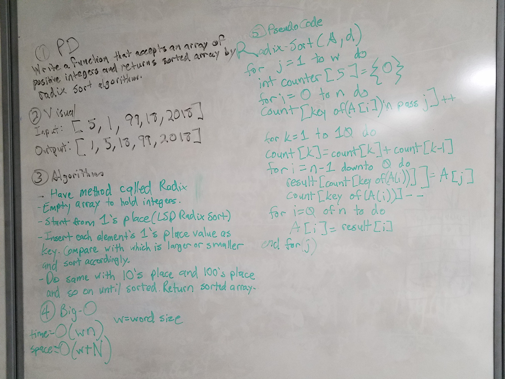

# Radix Sort

## Challenge

This challenge was to implement a radix sort algorithm. According to Wikipedia a radix sort is a non-comparative integer sorting algorithm that sorts data with integer keys by grouping keys by the individual digits which share the same significant position and value.

## Examples

##Licensing

This project is MIT licensed.